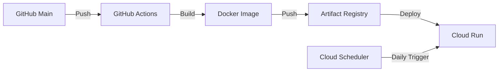

# 💴 YenUp

YenUp is a currency exchange rate monitoring tool built with Go. It checks the JPY exchange rate against a base currency (e.g., CAD) and sends Slack notifications when the Japanese Yen becomes stronger compared to the previous day.

This project demonstrates the implementation of **Clean Architecture** and **Dependency Injection** in Go, along with a modern **CI/CD pipeline** using Google Cloud Platform.

## 🚀 Features

- **Rate Monitoring**: Fetches daily exchange rates using external APIs.
- **Trend Alert**: Sends a Slack notification automatically when JPY strengthens (i.e., the base currency/JPY rate drops).
- **Smart Calculation**: Implements cross-rate calculation (via EUR) to support free-tier limitations of exchange rate APIs.
- **REST API**: Provides a RESTful endpoint to trigger checks manually and retrieve detailed rate data.
- **Cloud Native**: Deployed on Google Cloud Run with automated daily checks via Cloud Scheduler.

## 🛠 Tech Stack

- **Language**: Go 1.24+
- **Framework**: Gin (HTTP Web Framework)
- **Architecture**: Clean Architecture (Handlers, Usecases, Domains, Repositories)
- **Dependency Injection**: Registry pattern
- **External API**: exchangeratesapi.io / Frankfurter
- **Notification**: Slack Incoming Webhook
- **Infrastructure**: Google Cloud Run, Artifact Registry, Cloud Scheduler
- **CI/CD**: GitHub Actions

## 🏗 Architecture

The project follows the **Clean Architecture** principles to ensure separation of concerns and testability.

```text
cmd/
  └── yenup/        # Entry point (main.go)
internal/
  ├── config/       # Configuration management
  ├── domain/       # Domain models and repository interfaces
  ├── usecase/      # Business logic (rate comparison)
  ├── handler/      # HTTP handlers (Gin)
  ├── infrastructure/
  │   └── repository/ # External API & Slack implementation
  └── registry/     # Dependency Injection container
```

## 🚀 Deployment & CI/CD

The application is deployed to **Google Cloud Run** using a continuous delivery pipeline.



- **CI/CD**: GitHub Actions automatically builds and deploys the app on every push to the `main` branch.
- **Serverless**: Runs on Google Cloud Run (fully managed serverless container).
- **Automation**: Google Cloud Scheduler triggers the rate check every day at 9:00 AM (JST).

## 🏁 Getting Started

### Prerequisites

- Go 1.24 or higher
- Slack Webhook URL (for notifications)

### Installation

1. Clone the repository:
   ```bash
   git clone https://github.com/yourusername/yenup.git
   cd yenup
   ```

2. Create a `.env` file from the example:
   ```bash
   cp .env.example .env
   ```

3. Configure environment variables in `.env`:
   ```env
   # Server
   APP_PORT=8080

   # Currency
   BASE_CURRENCY=CAD
   TARGET_CURRENCY=JPY
   
   # API Provider (frankfurter or exchangerates)
   API_PROVIDER=frankfurter
   FRANKFURTER_API_URL=https://api.frankfurter.app/

   # Slack
   # Example (do not commit real values). Set this in your local `.env` or Cloud Run env vars:
   # SLACK_WEBHOOK_URL=YOUR_SLACK_WEBHOOK_URL
   SLACK_WEBHOOK_URL=
   ```

### Running the Application

```bash
go run cmd/yenup/main.go
```

### Usage

Trigger a rate check via HTTP request:

```bash
curl "http://localhost:8080/check-rate?base=CAD&target=JPY"
```

Response example:
```json
{
  "status": "success",
  "message": "Rate check executed successfully",
  "data": {
    "base": "CAD",
    "target": "JPY",
    "today_rate": 112.7396,
    "yesterday_rate": 113.2207,
    "change": "down (JPY stronger)",
    "is_notified": true
  }
}
```

## 🤝 Contributing

Contributions are welcome! Please feel free to submit a Pull Request.
